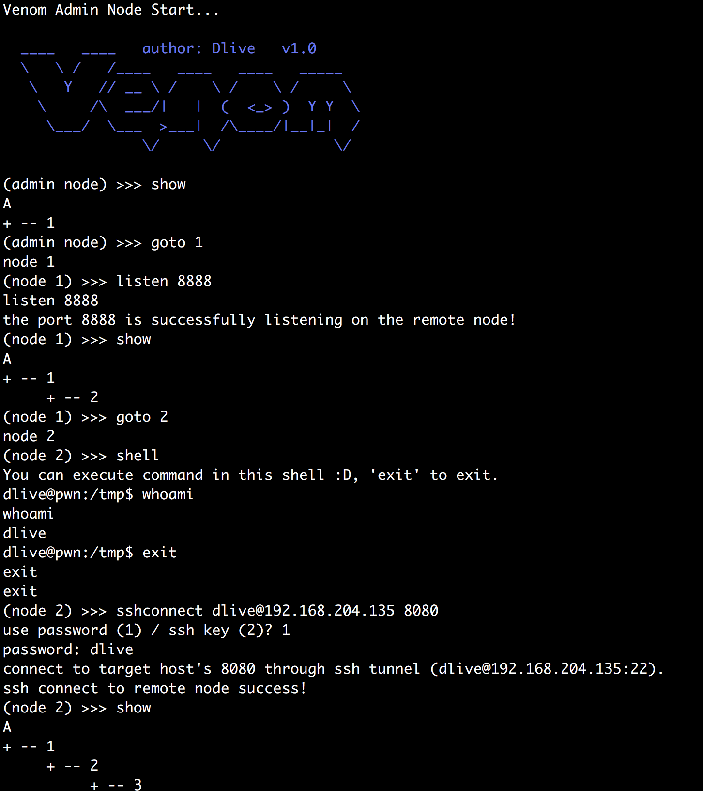

## Venom - A Multi-hop Proxy for Penetration Testers

[简体中文](README.md)　｜　[English](README-en.md)

Venom is a multi-hop proxy tool developed for attackers penetration testers using Go.

You can use venom to easily proxy network traffic to a multi-layer intranet, and easily manage intranet nodes.




> This tool is limited to security research and teaching, and the user bears all legal and related responsibilities caused by the use of this tool! The author does not assume any legal and related responsibilities!


## Features

- network topology
- multi-hop socks5 proxy
- multi-hop port forward
- port reuse (apache/mysql/...)
- ssh tunnel 
- interactive shell
- upload and download file
- supports multiple platforms(Linux/Windows/MacOS) and multiple architectures(x86/x64/arm/mips)

> Since the IoT device (arm/mips/... architecture) usually has limited resources, in order to reduce the size of the binary file, the binaries for the IoT environment do not support port reuse and ssh tunnel, and in order to reduce memory usage, the binaries only support less network concurrency and smaller buffers.

## Usage

### 1. admin/agent command line parameters

- **Both the admin node and the agent node can act as a server or client.**

  Admin listens on the port 9999, the agent connects to the admin:

  ```
  ./admin_macos_x64 -lport 9999
  ```

  ```
  ./agent_linux_x64 -rhost 192.168.0.103 -rport 9999
  ```

  Agent listens on the port 8888, the admin connects to the agent:

  ```
  ./agent_linux_x64 -lport 8888
  ```

  ```
  ./admin_macos_x64 -rhost 192.168.204.139 -rport 8888
  ```

- **The agent node supports port reuse.**

  Agent provides two port reuse methods

  1. Port reuse via SO_REUSEPORT and SO_REUSEADDR options
  2. Port reuse via iptables (Linux platform only)

  The ports of most services can be reused on linux. 

  The ports of services such as apache and mysql can be reused on Windows,  and the ports of RDP, IIS, etc. can not be reused temporarily. 

  The reused port can still provide its original service normally.

  **The first port reuse method**

  ```
  # Apache under windows environment: 
  # Reuse apache 80 port, does not affect apache to provide normal http service
  # The value of -h is the local ip, and can't be 0.0.0.0. Otherwise, port reuse cannot be performed.
  ./agent.exe -lhost 192.168.204.139 -reuse-port 80
  ```

  ```
  ./admin_macos_x64 -rhost 192.168.204.139 -rport 80
  ```
  **The second port reuse method**

  ```
  # Apache under linux environment:
  # Requires root privileges
  sudo ./agent_linux_x64 -lport 8080 -reuse-port 80
  ```

  This method will add the iptables rules, iptables forwards the traffic of the `reuse-port` to the `lport`, and then distribute the traffic by the agent.

  One thing to note is that if the `sigterm`or `sigint` ends the agent (kill or ctrl-c), the agent can automatically clean up the iptables rules. If the agent is killed by `kill -9`, the iptables rule cannot be automatically cleaned up and needs to be cleaned manually because the agent program cannot deal with the `sigkill` signal.  

  In order to prevent the iptables rules from being automatically cleaned up and the penetration tester cannot access the 80-port service, the second port reuse method uses `iptables -m recent` to control whether the iptables forwarding rules are enabled through special tcp packets.

  Reference https://threathunter.org/topic/594545184ea5b2f5516e2033

    ```
  # Start the iptables port reuse rules set by the agent on the linux host
  # If rhost is on the intranet, you can use the socks5 to proxy traffic. See the following for the use of the socks5 proxy.
  python scripts/port_reuse.py --start --rhost 192.168.204.135 --rport 80
    
  # Connect to the agent
  ./admin_macos_x64 -rhost 192.168.204.135 -rport 80
    
  # If you want to turn off iptables port reuse rules
  python scripts/port_reuse.py --stop --rhost 192.168.204.135 --rport 80
    ```

### 2. admin node built-in commands

- **help** (Print help information)

  ```
  (admin node) >>> help
  
    help                                     Help information.
    exit                                     Exit.
    show                                     Display network topology.
    getdes                                   View description of the target node.
    setdes     [info]                        Add a description to the target node.
    goto       [id]                          Select id as the target node.
    listen     [lport]                       Listen on a port on the target node.
    connect    [rhost] [rport]               Connect to a new node through current node.
    sshconnect [user@ip:port] [dport]        Connect to a new node through ssh tunnel.
    shell                                    Start an interactive shell on the target node.
    upload     [local_file]  [remote_file]   Upload files to the target node.
    download   [remote_file]  [local_file]   Download files from the target node.
    socks      [lport]                       Start a socks5 server.
    lforward   [lhost] [sport] [dport]       Forward a local sport to a remote dport.
    rforward   [rhost] [sport] [dport]       Forward a remote sport to a local dport.
    
  ```

- **show** (Display network topology)

  A represents the admin node, and the number represents the agent node.

  The following topology diagram shows that node1 connects to the admin node, node2 and node4 connect to 1 node, and node3 connects to node2.

  ```
  (node 1) >>> show
  A
  + -- 1
       + -- 2
            + -- 3
       + -- 4
  ```
  
  Note that to operate on a newly joined node, first run the show command on the admin node to synchronize the network topology and node number.


- **goto** (You want to operate a node)

  ```
  (admin node) >>> goto 1
  (node 1) >>> 
  ```
  After going to a node, you can use the commands that will be described below.

- **getdes/setdes** (Get/set node information description)

  ```
  (node 1) >>> setdes linux x64 blahblahblah
  (node 1) >>> getdes
  linux x64 blahblahblah
  ```

- **connect/listen/sshconnect** (Connect to another node/Accept connections from other nodes)

  Node1 connects to port 9999 of 192.168.0.103.
  ```
  (node 1) >>> connect 192.168.0.103 9999
  connect to 192.168.0.103 9999
  successfully connect to the remote port!
  (node 1) >>> show
  A
  + -- 1
       + -- 2
  ```

  Listening to port 9997 on the node1.
  Then run `./agent_linux_x64 -rhost 192.168.204.139 -rport 9997` on another machine to connect to node1.

  ```
  (node 1) >>> listen 9997
  listen 9997
  the port 9997 is successfully listening on the remote node!
  (node 1) >>> show
  A
  + -- 1
       + -- 2
       + -- 3
  ```

  Execute `./agent_linux_x64 -lport 9999` on 192.168.0.104, then node3 connects to port 9998 of 192.168.0.104 through the ssh tunnel using sshconnect command. 
  You can use ssh or private key for ssh authentication.

  ```
  (node 1) >>> goto 3
  (node 3) >>> sshconnect root@192.168.0.104:22 9999
  use password (1) / ssh key (2)? 2
  file path of ssh key: /Users/dlive/.ssh/id_rsa
  connect to target host's 9999 through ssh tunnel (root@192.168.0.104:22).
  ssh connect to remote node success!
  (node 3) >>> show
  A
  + -- 1
       + -- 2
       + -- 3
            + -- 4
  ```

- **shell** (Get a interactive shell of the target node)

  ```
  (node 1) >>> shell
  You can execute dispather in this shell :D, 'exit' to exit.
  bash: no job control in this shell
  bash-3.2$ whoami
  whoami
  dlive
  bash-3.2$ exit
  exit
  exit
  ```

- **upload/download** (Upload/download files from the target node)

  Upload local /tmp/test.pdf to node1's /tmp/test2.pdf

  ```  
  (node 1) >>> upload /tmp/test.pdf /tmp/test2.pdf
  upload /tmp/test.pdf to /tmp/test2.pdf
  this file is too large(>100M), still uploading? (y/n)y
   154.23 MiB / 154.23 MiB [========================================] 100.00% 1s
  upload file successfully!
  ```
  Download node1's file /tmp/test2.pdf to your local /tmp/test3.pdf
  ```
  (node 1) >>> download /tmp/test2.pdf /tmp/test3.pdf
  download /tmp/test2.pdf from /tmp/test3.pdf
  this file is too large(>100M), still downloading? (y/n)y
   154.23 MiB / 154.23 MiB [========================================] 100.00% 1s
  download file successfully!
  ```

- **socks** (Establish a socks5 proxy on the target node)

  ```
  (node 1) >>> socks 7777
  a socks5 proxy of the target node has started up on local port 7777
  ```

  After executing the socks command, a port will be opened locally on the admin node, such as 7777 above, using 7777 to perform the socks5 proxy.

- **lforward/rforward** (Forward local port to remote / forward remote port to local)

  Lforward forwards the local 8888 port of the admin node to the 8888 port of node1.

  ```
  (node 1) >>> lforward 127.0.0.1 8888 8888
  forward local network 127.0.0.1 port 8888 to remote port 8888
  ```

  Rforward forwards the 192.168.204.103 port 8889 of the node1 network to the local 8889 port of the admin node.
  ```
  (node 1) >>> rforward 192.168.204.103 8889 8889
  forward remote network 192.168.204.103 port 8889 to local port 8889
  ```

### 3. attention

- Only one admin node is supported at this stage to manage the network.
- To operate on a newly joined node, first run the show command on the admin node to synchronize the network topology and node number.
- When using the second port reuse method (based on iptables), you need to use `script/port_reuse.py` to enable the port reuse rules set by the agent on the target host.

## TODO

- combined with regeorg
- multiple administrator nodes
- network traffic encryption
- support socks5 udp
- RESTful API
- combined with meterpreter (to be discussed)

## Acknowledgement

- [rootkiter#Termite](https://github.com/rootkiter/Termite)
- [ring04h#s5.go](https://github.com/ring04h/s5.go)
- [n1nty#远程遥控 IPTables 进行端口复用](https://threathunter.org/topic/594545184ea5b2f5516e2033)