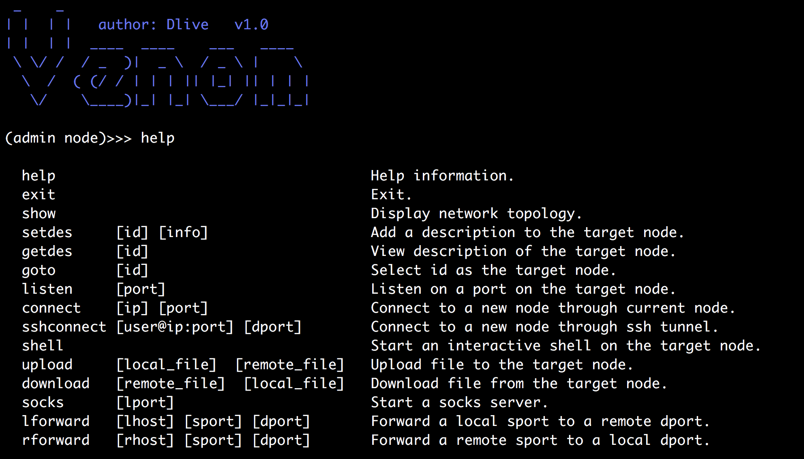

## Venom - A Multi-layer Proxy for Attackers

<a href="README.md">简体中文</a>
<a href="README-en.md">English</a>

You can easily use venom to automatically proxy your network traffic to a multi-layer intranet, and easily manage intranet nodes.

> This tool is limited to security research and teaching, and the user bears all legal and related responsibilities caused by the use of this tool! The author does not assume any legal and related responsibilities!

## Features

- network topology
- multi-layer socks5 proxy
- multi-layer port forward
- port reuse (apache/mysql/...)
- ssh tunnel 
- interactive shell
- upload and download file
- supports multiple platforms(Linux/Windows/MacOS) and multiple architectures(x86/x64/arm/mips)

> For IoT devices (arm/mips/...), I removed the port reuse and ssh tunnel features to reduce file size of agent, and reduce the value of some global variables to reduce memory usage of agent.

## Usage

## TODO

- combined with regeorg
- multiple administrator nodes
- network traffic encryption
- support socks5 udp
- RESTful API
- combined with meterpreter (to be discussed)

## Acknowledgement

- [rootkiter#Termite](https://github.com/rootkiter/Termite)
- [ring04h#s5.go](https://github.com/ring04h/s5.go)

